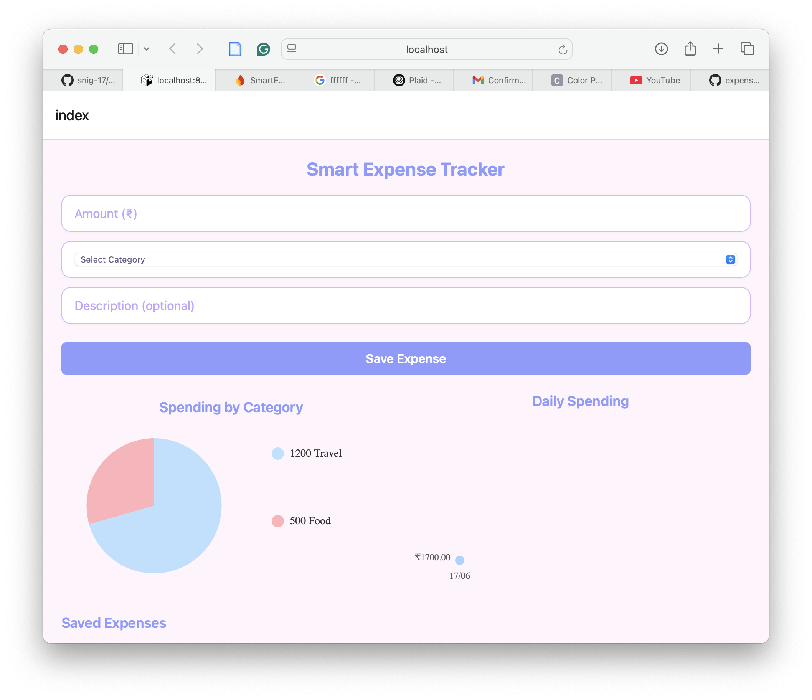
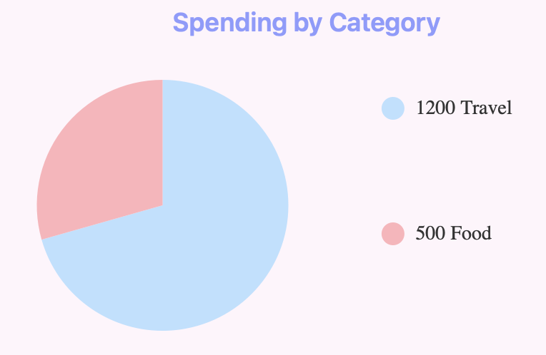
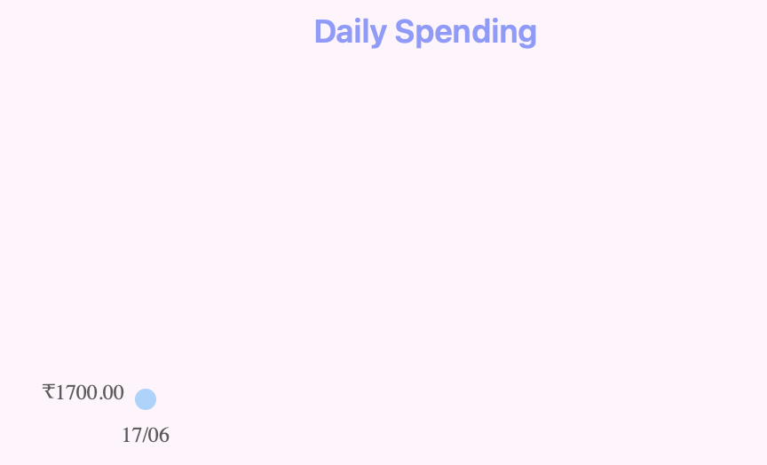

# 💸 Smart Expense Tracker

A simple and elegant React Native (Expo) app for tracking personal expenses, visualizing category-wise and daily spending with Firebase integration and interactive charts.

## 📱 Features

- Add and save expenses with **amount**, **category**, and **description**
- Visualize:
  - 💹 Category-wise breakdown via **Pie Chart**
  - 📈 Daily spending trends via **Line Chart**
- Firebase Firestore integration for real-time updates
- Stylish UI with a **pastel theme**
- Fully scrollable and mobile-friendly layout

## 🔧 Tech Stack

- **React Native** (with Expo)
- **Firebase Firestore** – real-time database
- `react-native-chart-kit` – for charts and graphs
- `@react-native-picker/picker` – category dropdown
- **Git + GitHub** – version control and collaboration

## 🚀 Getting Started

### 1. Clone the repository
```bash
git clone https://github.com/<your-username>/expense-tracker.git
cd expense-tracker
```

### 2. Install dependencies
```bash
npm install
```

### 3. Set up Firebase
- Create a Firebase project on [Firebase Console](https://console.firebase.google.com/)
- Enable **Firestore**
- Copy your Firebase config into `firebase.js`

```js
// firebase.js
import { initializeApp } from 'firebase/app';
import { getFirestore } from 'firebase/firestore';

const firebaseConfig = {
  apiKey: 'YOUR_API_KEY',
  authDomain: 'YOUR_AUTH_DOMAIN',
  projectId: 'YOUR_PROJECT_ID',
  storageBucket: 'YOUR_BUCKET',
  messagingSenderId: 'YOUR_SENDER_ID',
  appId: 'YOUR_APP_ID',
};

const app = initializeApp(firebaseConfig);
export const db = getFirestore(app);
```

### 4. Run the app
```bash
npx expo start
```

## ✨ Screenshots

Below are some visual examples of the app in action. To add your own screenshots, replace the image paths with your actual file paths or URLs.

| Home Page                         | Pie Chart                          | Line Chart                         |
|----------------------------------|------------------------------------|------------------------------------|
|  |    |  |

> 📂 Place your screenshots in the `/assets/screens/` folder or update the paths above to where your images are stored.

## 📌 Future Enhancements

- Integration with cards (e.g., Revolut, Plaid)
- User authentication and history sync
- Monthly budget goals
- Export to CSV

## 📝 License

This project is licensed under the MIT License. See the [LICENSE](LICENSE) file for details.
